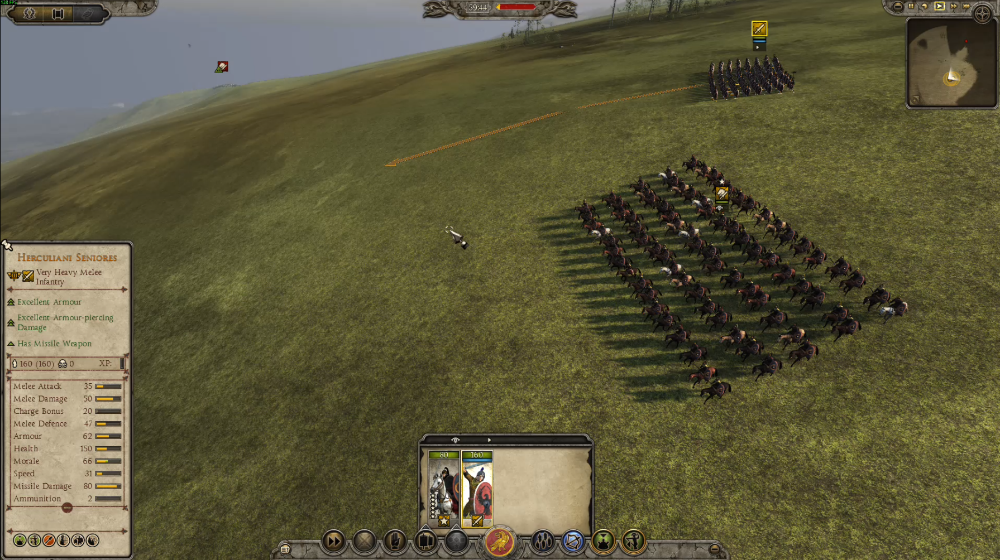
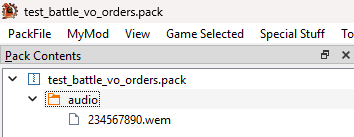

## Overview
This guide will walk you though the steps of how to convert a custom audio file to a format that can be used ingame and how to replace the game's default battle VO orders with your custom audio. Specifically, we will be making the game play a voice line when moving a unit.

Click the image below to hear an example of this guide's final result:  

## Prerequisites
1. SoundbankEditor - This application allows you to modify Total War Attila soundbank (`.bnk`) files. Note that the current version of SoundbankEditor is pre-alpha and your feedback will help improve it. You can download SoundbankEditor at https://github.com/TheTollski/SoundbankEditor/releases
2. AssetEditor - We will use a tool in this application called Audio Explorer which helps visualize audio events. You can download AssetEditor at https://github.com/donkeyProgramming/TheAssetEditor/releases
3. Wwise - We will use this application to convert audio files to a format that can be used by Total War Attila. In this guide I used Wwise version 2023.1.13. You can install Wwise through the Audiokinetic Launcher which you can download at https://www.audiokinetic.com/en/download/
  * Alternatively, you can download CA's official music modding kit for creating audio files for Rome 2 and Attila. This is the recommended tool for creating audio files for The Dawnless Days: https://cdn.creative-assembly.com/total-war/total-war/music-toolkit/Rome_2_Music_Modding_Kit.zip
4. Rusted PackFile Manager (RPFM) or a similar packfile editing application - We will use this application to create and modify your mod's packfile. You can download RPFM at https://github.com/Frodo45127/rpfm/releases

## Step 1: Convert your audio file.
Total War Attila can only read audio files that have the  `.wem` extension. In this step we will convert a `.wav` audio file to `.wem`. If you wish to skip this step, you can use the attached `234567890.wem` audio file.

1. Open Wwise.
2. Create a project.
3. Select `Project` and click `Project Settings...`. In the new window click Source Settings and set `Default Conversion Settings` to `Vorbis Quality High` and click `OK`.  
4. Select `Project` and click `Import Audio Files...`. In the new window click `Add Files...`, select your `.wav` audio file, and click `Import`.
5. Select `Project` and click `Convert All Audio Files...`. In the new window ensure `Windows` is selected and click `Convert`. There should now be a converted `.wem` audio file in your Wwise project's `.cache\Windows` folder (e.g. `C:\Users\MyUserName\Documents\WwiseProjects\MyWwiseProjectName\.cache\Windows\SFX`).

[234567890.wem](Battle_VO_Orders_Resources/234567890.wem)

## Step 2: Set up your mod's packfile and add the converted audio file to it.
In this step we will set up a packfile for your mod and add the converted audio file to it.

1. Open RPFM or a similar packfile editing application.
2. Select `Game Selected` and click `Attila`.
3. Create a packfile for your mod or open the packfile of a mod you want to edit.
4. Create a folder called `audio`.
5. Add your converted `.wem` audio file to the mod's `audio` folder.
6. Rename the the audio file so the file name is a random Wwise short ID (i.e. a number between 0 and 4,294,967,295), keep the file extension as `.wem`.  

## Step 3: Edit the `battle_vo_orders` soundbank.
Total War Attila uses soundbanks (i.e. `.bnk` files) to determine what audio to play when events are triggered. The `battle_vo_orders` soundbank is set up so that the `Battle_Order_VO_Play_` Event uses the `VO_battle_culture`, `VO_battle_actor`, and `VO_battle_order` parameters (called "groups") to determine which sound to play.

There are dozens of specific battle VO orders soundbanks (e.g. `battle_vo_orders_eastern_inf1.bnk)` in the original Total War Attila files; the game loads all these files to form the Battle VO Order audio logic that it uses ingame. It is complicated and tedious to make changes when so many so many files for battle VO orders are loaded, so in this tutorial we will use a custom `battle_vo_orders.bnk` file which overrides the game's default one and disables the game's specific battle VO orders soundbanks.

In this step we will edit the custom `battle_vo_orders` soundbank so that when a unit given a single click move order it will sometimes play our custom audio.

1. Download [battle_vo_orders.bnk](Battle_VO_Orders_Resources/battle_vo_orders.bnk) and [battle_vo_orders_custom_names.txt](Battle_VO_Orders_Resources/battle_vo_orders_custom_names.txt).  
2. Open SoundbankEditor.  
3. Open the downloaded `battle_vo_orders.bnk`.  
4. Go to the Event `1391812361` (`Battle_Order_VO_Play`) and check its `ActionId`.  
5. Go to the Action `34896051` and check its `IdExt`.  
6. Go to the SwitchContainer `697944012` (`Bvo`) and check its switch packages. In the original `battle_vo_orders` soundbank there would be four switches, one for each "battle culture", but in this custom soundbank I configured only a single switch package to be used for all battle cultures.
7. Go to the SwitchContainer `3592767466` (`Bvo_Roman`) and check its switch packages. In the original `battle_vo_orders` soundbank there would be about a dozen switches, one for each "battle actor", but in this custom soundbank I configured only a single switch package to be used for all battle actors.
8. Go to the SwitchContainer `3699923075` (`Bvo_Roman_Inf1`) and check its switch packages. In the original `battle_vo_orders` soundbank there would be dozens of switches, one for each "battle order", but in this custom soundbank I configured only two switch packages, one default to be used for all battle orders and one specific for single-click move orders.
9. Go to the RandomSequenceContainer `3325810246` (`Bvo_Roman_Inf1_SingleClickMoveTo`) and check its playlist items. In the original `battle_vo_orders` soundbank there would be more than one item, but in this custom soundbank I configured only a single sound to be played instead of multiple sounds to be picked at random.
7. Go to the Sound `506764198` (`Bvo_Roman_Inf1_SingleClickMoveTo_1`) and set `File ID` to the short ID used for your audio file.
8. Save the soundbank.

## Step 4: Add the edited soundbank to the mod's packfile, configure an additional faction to use your custom audio, and install the mod into Total War Attila.
In this step we will add the edited soundbank to your mod, we will configure the Western Roman Empire to use your modified `barbarian_pagan` campaign voiceover culture, and then we will install your mod to be used by Total War Attila.

1. Open RPFM.
2. Add your edited `battle_vo_orders.bnk` and SoundbankEditor's autogenerated `battle_vo_orders_custom_names.txt` into the mod's `audio` folder. Note: The custom names file is not required for the audio to play ingame but it is used by SoundbankEditor to show any custom text IDs that you have added into the soundbank.  
3. Select `PackFile` and click `Save PackFile`.
4. Select `PackFile` and click `Install`.

## Viewing your changes in AssetEditor.
If you want to view the audio configuration when all soundbanks are loaded you can use AssetEditor's Audio Explorer. This can be helpful for debugging issues when sound is not playing ingame as expected. In this section, we will take a look at the `campaign_selected` dialogue event's configuration to verify our changes.

1. Open AssetEditor.
2. Select `Options` and click `Settings`. Set `Current Game` to `Attila` and click `Save`.
3. Select `File`, select `Load all game packfiles`, and click `Attila`.
4. Select `File`, click `Open`, and load the mod's packfile.
5. Select `Tools`, select `Audio`, and click `Audio Explorer`.
6. In the Audio Explorer, select the event `Battle_Order_VO_Play`. Verify that it uses your custom audio file for the `single_click_move_to` order.

## Testing your changes ingame.
Now it is time to hear our custom audio ingame.

1. In the Total War Launcher, ensure your mod is enabled and at the top of the load order.  
2. Launch Total War Attila, start a new Custom Battle elephants and make sure that your custom audio plays when you issue a single-click move order. It may not play each time, because the game can decide to use different orders than the `single_click_move_to` when issuing move orders.

## Example Packfile

I have attached the mod packfile which I created for this guide. If you are having any issues with getting your custom audio to play ingame you can download the packfile and compare it against yours.

[test_battle_vo_orders.pack](Battle_VO_Orders_Resources/test_battle_vo_orders.pack)

## Next Steps

Take a look at the [Battle VO Orders Investigations](../Investigations/Investigation_BattleVoOrders.md) page to learn the limitations that the game has for battle VO orders.

If you want to learn more about how Wwise audio works, you can take a look at the documentation for WWISER, an application that parses `.bnk` files: https://github.com/bnnm/wwiser/blob/master/doc/WWISER.md