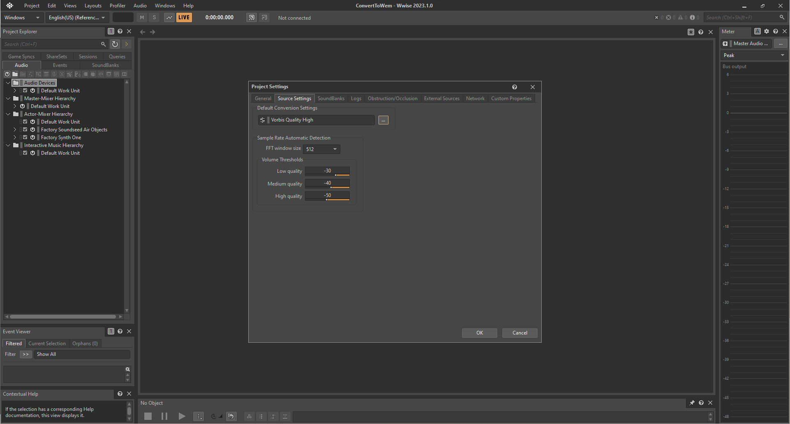
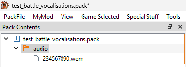
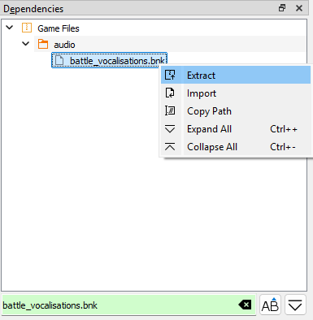

## Overview
This guide will walk you though the steps of how to convert a custom audio file to a format that can be used ingame and how to replace the game's default battle vocalisations with your custom audio. Specifically, we will be making the game play a custom sound when elephants are running.

Click the image below to hear an example of this guide's final result:  

## Prerequisites
1. SoundbankEditor - This application allows you to modify Total War Attila soundbank (`.bnk`) files. Note that the current version of SoundbankEditor is pre-alpha and your feedback will help improve it. You can download SoundbankEditor at https://github.com/TheTollski/SoundbankEditor/releases
2. AssetEditor - We will use a tool in this application called Audio Explorer which helps visualize audio events. You can download AssetEditor at https://github.com/donkeyProgramming/TheAssetEditor/releases
3. Wwise - We will use this application to convert audio files to a format that can be used by Total War Attila. In this guide I used Wwise version 2023.1.0. You can install Wwise through the Audiokinetic Launcher which you can download at https://www.audiokinetic.com/en/download/
  * Alternatively, you can download CA's official music modding kit for creating audio files for Rome 2 and Attila. This is the recommended tool for creating audio files for The Dawnless Days: https://cdn.creative-assembly.com/total-war/total-war/music-toolkit/Rome_2_Music_Modding_Kit.zip
4. Rusted PackFile Manager (RPFM) or a similar packfile editing application - We will use this application to create and modify your mod's packfile. You can download RPFM at https://github.com/Frodo45127/rpfm/releases

## Step 1: Convert your audio file.
Total War Attila can only read audio files that have the  `.wem` extension. In this step we will convert a `.wav` audio file to `.wem`. If you wish to skip this step, you can use the attached `234567890.wem` audio file.

1. Open Wwise.
2. Create a project.
3. Select `Project` and click `Project Settings...`. In the new window click Source Settings and set `Default Conversion Settings` to `Vorbis Quality High` and click `OK`.  

4. Select `Project` and click `Import Audio Files...`. In the new window click `Add Files...`, select your `.wav` audio file, and click `Import`.
5. Select `Project` and click `Convert All Audio Files...`. In the new window ensure `Windows` is selected and click `Convert`. There should now be a converted `.wem` audio file in your Wwise project's `.cache\Windows` folder (e.g. `C:\Users\MyUserName\Documents\WwiseProjects\MyWwiseProjectName\.cache\Windows\SFX`).

[234567890.wem](Battle_Vocalisations_Resources/234567890.wem)

## Step 2: Set up your mod's packfile and add the converted audio file to it.
In this step we will set up a packfile for your mod and add the converted audio file to it.

1. Open RPFM or a similar packfile editing application.
2. Select `Game Selected` and click `Attila`.
3. Create a packfile for your mod or open the packfile of a mod you want to edit.
4. Create a folder called `audio`.
5. Add your converted `.wem` audio file to the mod's `audio` folder.
6. Rename the the audio file so the file name is a random Wwise short ID (i.e. a number between 0 and 4,294,967,295), keep the file extension as `.wem`.  

## Step 3: Edit the `battle_vocalisations` soundbank.
Total War Attila uses soundbanks (i.e. `.bnk` files) to determine what audio to play when events are triggered. The `battle_vocalisations` soundbank is set up so that the `battle_vocalisation_elephant_running` Event randomly plays one sound from a list. In other words, when elephants are running, the game will randomly play sounds from a list of running elephant sounds.

In this step we will edit the `battle_vocalisations` soundbank to so that when the game triggers the "elephant running" event it will play our custom sound.

1. In RPFM, look in the `Dependencies` panel, expand `Game Files`, expand the `audio` folder, and extract `battle_vocalisations.bnk`.  

2. Open SoundbankEditor.  
3. Open the extracted `battle_vocalisations.bnk`.  
4. Go to the Event `596432080` (`battle_vocalisation_elephant_running`)  and check its `ActionId`.  
5. Go to the Action `921399154` and check its `IdExt`.  
6. Go to the RandomSequenceContainer `987114156` and check its playlist items IDs. Delete all the IDs from the list except the first.  
7. Go to the Sound `954912089` and set the `StreamType` to `2`, set the `SourceId` and `FileId` to the short ID used for your audio file, remove the `FileOffset` line, set `InMemoryMediaSize` to `0`, and set `SourceBits` to `1`. Note: Some of these changes are necessary because the default battle vocalisations Sound items are configured to play audio that is packaged in a data soundbank, but we want this Sound to play audio from our converted WEM file.
8. Save the soundbank.

## Step 4: Add the edited soundbank to the mod's packfile, configure an additional faction to use your custom audio, and install the mod into Total War Attila.
In this step we will add the edited soundbank to your mod, we will configure the Western Roman Empire to use your modified `barbarian_pagan` campaign voiceover culture, and then we will install your mod to be used by Total War Attila.

1. Open RPFM.
2. Add your edited `battle_vocalisations.bnk` and SoundbankEditor's autogenerated `battle_vocalisations_custom_names.txt` into the mod's `audio` folder. Note: The custom names file is not required for the audio to play ingame but it is used by SoundbankEditor to show any custom text IDs that you have added into the soundbank.  
3. Select `PackFile` and click `Save PackFile`.
4. Select `PackFile` and click `Install`.

## Viewing your changes in AssetEditor.
If you want to view the audio configuration when all soundbanks are loaded you can use AssetEditor's Audio Explorer. This can be helpful for debugging issues when sound is not playing ingame as expected. In this section, we will take a look at the `campaign_selected` dialogue event's configuration to verify our changes.

1. Open AssetEditor.
2. Select `Options` and click `Settings`. Set `Current Game` to `Attila` and click `Save`.
3. Select `File`, select `Load all game packfiles`, and click `Attila`.
4. Select `File`, click `Open`, and load the mod's packfile.
5. Select `Tools`, select `Audio`, and click `Audio Explorer`.
6. In the Audio Explorer, select the event `battle_vocalisation_elephant_running`. Verify that it uses your custom audio file.  

## Testing your changes ingame.
Now it is time to hear our custom audio ingame.

1. In the Total War Launcher, ensure your mod is enabled and at the top of the load order.  
2. Launch Total War Attila, start a new Custom Battle elephants and make sure that your custom audio plays when the elephants are running (you may need to zoom in close to them).

## Example Packfile

I have attached the mod packfile which I created for this guide. If you are having any issues with getting your custom audio to play ingame you can download the packfile and compare it against yours.

[test_battle_vocalisations.pack](Battle_Vocalisations_Resources/test_battle_vocalisations.pack)

## Next Steps

In SoundbankEditor you can add/edit more Sound items and add their IDs to the RandomSequenceContainer to have a pool of sounds that can play at random when elephants are running. You can also change the audio for other elephant battle vocalisations events, such as their attack and death audio.

If you want to learn more about how Wwise audio works, you can take a look at the documentation for WWISER, an application that parses `.bnk` files: https://github.com/bnnm/wwiser/blob/master/doc/WWISER.md