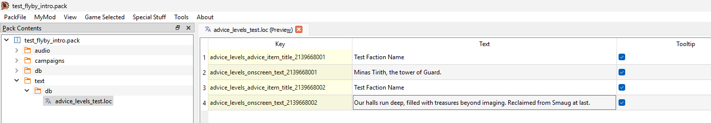
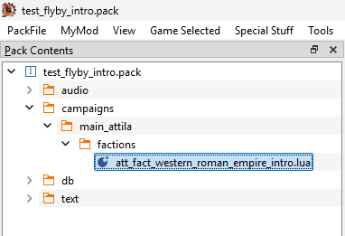
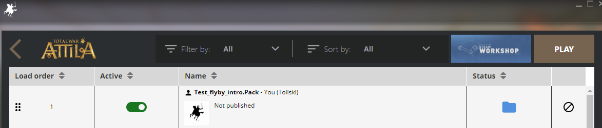

## Overview
This guide will walk you though the steps of how to convert custom audio files to a format that can be used ingame and how to use your custom audio files in campaign advisor flyover intros.

Click the image below to hear an example of this guide's final result:  

## Prerequisites
1. Wwise - We will use this application to convert audio files to a format that can be used by Total War Attila. In this guide I used Wwise version 2023.1.0. You can install Wwise through the Audiokinetic Launcher which you can download at https://www.audiokinetic.com/en/download/
  * Alternatively, you can download CA's official music modding kit for creating audio files for Rome 2 and Attila. This is the recommended tool for creating audio files for The Dawnless Days: https://cdn.creative-assembly.com/total-war/total-war/music-toolkit/Rome_2_Music_Modding_Kit.zip
2. Rusted PackFile Manager (RPFM) or a similar packfile editing application - We will use this application to create and modify your mod's packfile. You can download RPFM at https://github.com/Frodo45127/rpfm/releases

## Step 1: Convert your audio file.
Total War Attila can only read audio files that have the  `.wem` extension. In this step we will convert `.wav` audio files to `.wem`. If you wish to skip this step, you can use the attached example audio files.

1. Open Wwise.
2. Create a project.
3. Select `Project` and click `Project Settings...`. In the new window click Source Settings and set `Default Conversion Settings` to `Vorbis Quality High` and click `OK`.  

4.  Select `Project` and click `Import Audio Files...`. In the new window click `Add Files...`, select your `.wav` audio file, and click `Import`.
5. Select `Project` and click `Convert All Audio Files...`. In the new window ensure `Windows` is selected and click `Convert`. There should now be a converted `.wem` audio file in your Wwise project's `.cache\Windows` folder (e.g. `C:\Users\MyUserName\Documents\WwiseProjects\MyWwiseProjectName\.cache\Windows\SFX`).

[att_advice_intro_flyby_test_1_1.wem](Campaign_Intro_Flyby_Resources/att_advice_intro_flyby_test_1_1.wem)
[att_advice_intro_flyby_test_2_1.wem](Campaign_Intro_Flyby_Resources/att_advice_intro_flyby_test_2_1.wem)

## Step 2: Set up your mod's packfile and add the converted audio file to it.
In this step we will set up a packfile for your mod and add the converted audio files to it.

1. Open RPFM or a similar packfile editing application.
2. Select `Game Selected` and click `Attila`.
3. Create a packfile for your mod or open the packfile of a mod you want to edit.
4. Create a folder called `audio` and in that new folder create another folder called `advisor`.
5. Add your converted `.wem` audio files to the mod's `audio/advisor` folder.
6. Rename the the audio files so the file names follow the format `att_advice_intro_flyby_{Title}_{Number}_1.wem`.

# Step 3:
In this step we will extract the Western Roman Empire's intro script and edit it to use our custom advisor lines and audio.

1. In RPFM, look in the `Dependencies` panel, expand `Game Files`, expand the `campaigns/main_attila/factions` folder, and extract `att_fact_western_roman_empire_intro.lua`.  

2. Open `att_fact_western_roman_empire_intro.lua` in a text editor on your computer.
3. Edit line 23 to: `cm:show_advice("att_advice_intro_flyby_test_1", true)`
4. Add a new line on 66: `cutscene_intro:action(function() cm:show_advice("att_advice_intro_flyby_test_2", true) end, 5);`

## Step 4: Configure the new advisor lines, and install the mod into Total War Attila.
In this step we will configure the DB and localization files to support your new advisor lines, we will add the edited intro script to your mod, and then we will install your mod to be used by Total War Attila.

1. Open RPFM
2. Create a DB based on the `advice_threads_tables` schema and call it `advice_threads_test`. Then, look in the `Dependencies` panel, expand `Game Files`, expand the `db` folder, expand `advice_threads_tables`, open `advice_threads`, select line 569 (the row with `att_advice_intro_flyby_roman_west`), copy it, open `advice_threads_test` (which you just created), right click in the empty window and select `Paste as New Row`, and set the new row's Thread to `att_advice_intro_flyby_test_1`. Create as many new rows as you have audio files.

3. Create a DB based on the `advice_levels_tables` schema and call it `advice_levels_test`. Then, look in the `Dependencies` panel, expand `Game Files`, expand the `db` folder, expand `advice_levels_tables`, open `advice_levels`, select line 409 (the row with `att_advice_intro_flyby_roman_west`), copy it, open `advice_levels_test` (which you just created), right click in the empty window and select `Paste as New Row`, and set the new row's Key to `2139668001` and the new row's Advice Thread to `att_advice_intro_flyby_test_1`. Create as many new rows as you have audio files.

4. Create a Text with the path `text/db/advice_levels_test.loc`. Open `advice_levels_test.loc` (which you just created), right click in the empty window and select `Add Row`, and set the new row's Key to `advice_levels_advice_item_title_2139668001`, set its Text to `Test Faction Name`, and check its Tooltip. Add another row, and set the new row's Key to `advice_levels_onscreen_text_2139668001`, set its Text to whatever your audio file says, and check its Tooltip. Create 2 rows for each of your audio files.

5. Create a folder called `campaigns` and in that new folder create another folder called `main_attila` and in that new folder create another folder called `factions`.
6. Add your edited `att_fact_western_roman_empire_intro.lua` and into the mod's `campaigns/main_attila/factions` folder.

7. Select `PackFile` and click `Save PackFile`.
8. Select `PackFile` and click `Install`.

## Testing your changes ingame.
Now it is time to hear our custom audio ingame.

1. In the Total War Launcher, ensure your mod is enabled and at the top of the load order.  

2. Launch Total War Attila, start a new Grand Campaign with the Western Roman Empire, and ensure that your custom audio and text plays during the intro flyby.

## Example Packfile

I have attached the mod packfile which I created for this guide. If you are having any issues with getting your custom audio to play ingame you can download the packfile and compare it against yours.

[test_flyby_intro.pack](Campaign_Intro_Flyby_Resources/test_flyby_intro.pack)