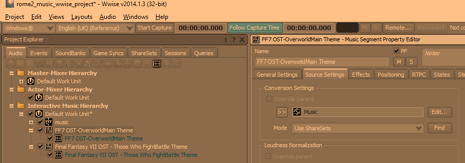

## Overview
This guide will walk you though the steps of how to convert custom audio files to a format that can be used for music in Total War Attila and how to replace the game's default campaign music with your custom music. Specifically, we will be making the game play a custom ambient music track and prebattle music track on the campaign map.

Click the image below to hear an example of this guide's final result:  

## Prerequisites
1. SoundbankEditor - This application allows you to modify Total War Attila soundbank (`.bnk`) files. Note that the current version of SoundbankEditor is pre-alpha and your feedback will help improve it. You can download SoundbankEditor at https://github.com/TheTollski/SoundbankEditor/releases
2. Wwise - We will use this application to convert audio files to a format that can be used by Total War Attila. For this guide you must use Wwise version 2014.1.3, which you can install by downloading CA's official music modding kit for Rome 2 and Attila: https://cdn.creative-assembly.com/total-war/total-war/music-toolkit/Rome_2_Music_Modding_Kit.zip
3. Rusted PackFile Manager (RPFM) or a similar packfile editing application - We will use this application to create and modify your mod's packfile. You can download RPFM at https://github.com/Frodo45127/rpfm/releases
4. [Non-Dynamic Battle Music mod](https://steamcommunity.com/sharedfiles/filedetails/?id=1488345715) for Total War Attila. Attila normally uses dynamic music which is very hard to work with, this mod makes Attila use regular, full-length music tracks. This file can be downloaded directly in your browser using a website like: http://steamworkshop.download/download/view/1488345715

## Step 1: Convert your audio files.
Total War Attila can only read audio files that have the  `.wem` extension. In this step we will convert 2 `.wav` audio files to `.wem`. If you wish to skip this step, you can use the attached `123456789.wem` and `234567890.wem` audio files.

1. Open `rome2_music_wwise_project.wproj` (from prerequisite #2) in Wwise v2014.1.3.
2. In the `Project Explorer` panel's `Audio` tab, find `Interactive Music Hierarchy` and right click its child `Default Work Unit`, click `Import Audio Files...`. In the new window click `Add Files...`, select your `.wav` audio files, and click `Import`.
3. Click the box with `+` to the left of the `Default Work Unit` to show its children. Click the boxes with `+` to the left of each audio file you imported.
4. For each of your audio files:
    1. Select the parent element of that audio file (the `Music Segment` for that file), go to the `Source Settings` tab, click the box with `>>` to the left of `Default Conversion Setting`, and select `Music`. The conversion settings should now be set to `Music`.
    
    2. Select the child element of that audio file (the `Music Track` for that file), go to the `General Settings` tab, and check the `Stream` box.
    
5. Select `Project` and click `Convert All Audio Files...`. In the new window ensure `Windows` is checked and click `Ok`. There should now be converted `.wem` audio files in your Wwise project's `.cache\Windows\SFX` folder (e.g. `C:\Downloads\Rome_2_Music_Modding_Kit\Rome_2_Music_Modding_Kit\Wwise Project\.cache\Windows\SFX`).

[123456789.wem](Campaign_Music_Resources/123456789.wem)
[234567890.wem](Campaign_Music_Resources/234567890.wem)

## Step 2: Set up your mod's packfile and add the converted audio file to it.
In this step we will set up a packfile for your mod and add the converted audio file to it.

1. Open RPFM or a similar packfile editing application.
2. Select `Game Selected` and click `Attila`.
3. Create a packfile for your mod or open the packfile of a mod you want to edit.
4. Create a folder called `audio`.
5. Add your converted `.wem` audio files to the mod's `audio` folder.
6. Rename the the audio files so the file names are a random Wwise short IDs (i.e. a number between 0 and 4,294,967,295), keep the file extension as `.wem`.  

## Step 3: Edit the `global_music` soundbank.
Total War Attila uses soundbanks (i.e. `.bnk` files) to determine what audio to play when events are triggered. The `global_music` soundbank is set up so that the various music events take variables for music state (e.g. prebattle, ambient) and culture and they have decision trees which reference RandomSequenceContainers which reference lists of Sounds. In other words, when the game triggers a campaign music event it will use the music state and a mix of the player's encountered cultures in order to pick a list of random music tracks and it will play one of those random music tracks.

In this step we will edit a custom `global_music` soundbank to so that when the game triggers a campaign music event for the `barbarian` culture it will play our custom prebattle or ambient music tracks.

1. After downloading the Non-Dynamic Battle Music mod (prerequisite #4), unzip it. In RPFM, select `PackFile` > `Open PackFile`, and open `nondynamicmusic.pack`. In the `Pack Contents` panel, expand `nondynamicmusic.pack`, expand the `audio` folder, and extract `global_music.bnk`.  
2. Open SoundbankEditor.
3. Open the extracted `global_music.bnk`.
4. Go to the MusicSwitchContainer `95368203` and look at its decision tree to get the AudioNodeId for `standard`.  
5. Go to the MusicSwitchContainer `359245500` and look at its decision tree to get the AudioNodeId for `barbarian`.  
6. Go to the MusicRandomSequenceContainer `864612182` and look at its playlist items to get the SegmentId of the first item with RsType equal to `4294967295`.
7. Go to the MusicSegment `182838220` and change its Duration and its 2nd AK music marker's position both from `93187.3242630386` to the length of your custom ambient music track (in milliseconds). Look at its child IDs and get the only ID in that list.
8. Go to the MusicTrack `1042603326` and change its track source infos' SrcDuration from `93187.3242630386` to the length of your custom ambient music track (in milliseconds). Change its source's SourceId and FileId and its track source infos' SourceId from `560373866` to the number you used to rename your ambient WEM music track.
9. Go back to the MusicSwitchContainer `95368203` and look at its decision tree to get the AudioNodeId for `prebattle`.  
10. Go to the MusicSwitchContainer `2886985` and look at its decision tree to get the AudioNodeId for `barbarian`.  
11. Go to the MusicRandomSequenceContainer `934311252` and look at its playlist items to get the SegmentId of the only item with RsType equal to `4294967295`.
12. Go to the MusicSegment `1047327910` and change its Duration and its 2nd AK music marker's position both from `30461.5646258503` to the length of your custom prebattle music track (in milliseconds). Look at its child IDs and get the only ID in that list.
13. Go to the MusicTrack `268426955` and change its track source infos' SrcDuration from `30461.54195011338` to the length of your custom prebattle music track (in milliseconds). Change its source's SourceId and FileId and its track source infos' SourceId from `772483639` to the number you used to rename your prebattle WEM music track.   
14. Save the soundbank.

## Step 4: Add the edited soundbank to the mod's packfile and install it into Total War Attila.
In this step we will add the edited soundbank to your mod and then we will install your mod to be used by Total War Attila.

1. Open RPFM and open your mod's pack file.
2. Add your edited `global_music.bnk` and SoundbankEditor's autogenerated `global_music_custom_names.txt` into the mod's `audio` folder. Note: The custom names file is not required for the audio to play ingame but it is used by SoundbankEditor to show any custom text IDs that you have added into the soundbank.  

3. Select `PackFile` and click `Save PackFile`.
4. Select `PackFile` and click `Install`.

## Testing your changes ingame.
Now it is time to hear our custom audio ingame.

1. In the Total War Launcher, ensure your mod is enabled and at the top of the load order.  
2. Launch Total War Attila, start a new Grand Campaign with the Saxons, and ensure that your custom ambient music sometimes plays on the campaign screen (it is 1 out of 15 Barbarian ambient music tracks, so you may have to keep reloading until you can confirm that it plays correctly) and ensure that your custom prebattle music always plays when in the prebattle phase of the campaign.

## Example Packfile

I have attached the mod packfile which I created for this guide. If you are having any issues with getting your custom audio to play ingame you can download the packfile and compare it against yours.

[test_campaign_music.pack](Campaign_Music_Resources/test_campaign_music.pack)

## Next Steps

In SoundbankEditor you can change the audio for the remaining Barbarian ambient music tracks or for other cultures' ambient music tracks. It is also possible to add or remove playist items in a MusicRandomSequenceContainer, making it possible to do things like supporting multiple prebattle tracks instead of only having 1 per culture.

If you want to learn more about how Wwise audio works, you can take a look at the documentation for WWISER, an application that parses `.bnk` files: https://github.com/bnnm/wwiser/blob/master/doc/WWISER.md