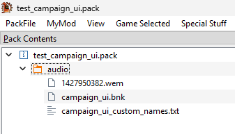

## Overview
This guide will walk you though the steps of how to convert custom audio files to a format that can be used for campaign UI in Total War Attila and how to replace the game's default campaign UI audio with your custom audio. Specifically, we will be making the game play custom audio when the player ends their turn.

Click the image below to hear an example of this guide's final result:  

## Prerequisites
1. SoundbankEditor - This application allows you to modify Total War Attila soundbank (`.bnk`) files. Note that the current version of SoundbankEditor is pre-alpha and your feedback will help improve it. You can download SoundbankEditor at https://github.com/TheTollski/SoundbankEditor/releases
2. AssetEditor - We will use a tool in this application called Audio Explorer which helps visualize audio events. You can download AssetEditor at https://github.com/donkeyProgramming/TheAssetEditor/releases
3. Wwise - We will use this application to convert audio files to a format that can be used by Total War Attila. For this guide you must use Wwise version 2014.1.3, which you can install by downloading CA's official music modding kit for Rome 2 and Attila: https://cdn.creative-assembly.com/total-war/total-war/music-toolkit/Rome_2_Music_Modding_Kit.zip
4. Rusted PackFile Manager (RPFM) or a similar packfile editing application - We will use this application to create and modify your mod's packfile. You can download RPFM at https://github.com/Frodo45127/rpfm/releases

## Step 1: Convert your audio files.
Total War Attila can only read audio files that have the  `.wem` extension. In this step we will convert 2 `.wav` audio files to `.wem`. If you wish to skip this step, you can use the attached `123456789.wem` and `234567890.wem` audio files.

1. Open `rome2_music_wwise_project.wproj` (from prerequisite #2) in Wwise v2014.1.3.
2. In the `Project Explorer` panel's `Audio` tab, find `Actor-Mixer Hierarchy` and right click its child `Default Work Unit`, click `Import Audio Files...`. In the new window click `Add Files...`, select your `.wav` audio file, and click `Import`.
3. Click the box with `+` to the left of the `Default Work Unit` to show its children.
4. Select the audio file, go to the `General Settings` tab, and check the `Stream` box. Then, go to the `Source Settings` tab, click the box with `>>` to the left of `Default Conversion Setting`, and select `Music`.

5. Select `Project` and click `Convert All Audio Files...`. In the new window ensure `Windows` is checked and click `Ok`. There should now be a converted `.wem` audio file in your Wwise project's `.cache\Windows\SFX` folder (e.g. `C:\Downloads\Rome_2_Music_Modding_Kit\Rome_2_Music_Modding_Kit\Wwise Project\.cache\Windows\SFX`).

[1427950382.wem](Campaign_UI_Resources/1427950382.wem)

## Step 2: Set up your mod's packfile and add the converted audio file to it.
In this step we will set up a packfile for your mod and add the converted audio file to it.

1. Open RPFM or a similar packfile editing application.
2. Select `Game Selected` and click `Attila`.
3. Create a packfile for your mod or open the packfile of a mod you want to edit.
4. Create a folder called `audio`.
5. Add your converted `.wem` audio files to the mod's `audio` folder.
6. Rename the the audio files so the file names are a random Wwise short IDs (i.e. a number between 0 and 4,294,967,295), keep the file extension as `.wem`.  

## Step 3: Edit the `campaign_ui` soundbank.
Total War Attila uses soundbanks (i.e. `.bnk` files) to determine what audio to play when events are triggered. The `campaign_ui` soundbank is set up so that the `campaign_ui_end_turn` Event references an Action which references a SwitchContainer which uses the `music_culture` variable to select a sound to play from a list of Sounds. In other words, when the game triggers the "end turn" campaign UI event it will play one of 4 sounds (based on the player's faction's culture).

In this step we will edit a custom `campaign_ui` soundbank so that when the game triggers the "end turn" campaign UI event it will play your custom audio file, for all cultures.

1. In RPFM, look in the `Dependencies` panel, expand `Game Files`, expand the `audio` folder, and extract `campaign_ui.bnk`.  

2. Open SoundbankEditor.
3. Open the extracted `campaign_ui.bnk`.
4. Select the Event `878146536` (`campaign_ui_end_turn`) and check its `ActionId`.
5. Select the Action `521732382` check its `IdExt`.
6. Select the SwitchContainer `902582007` and check its Switch Packages. Delete all rows except for the first row (`748895195 [None]`). Edit the node ID list for the first row, changing the only ID from `404964621` to `Generic_CampaignEndTurn_1` (which will be converted to `3170217961`).

7. Select the Sound `893785850` and duplicate it.
8. Select the new Sound. Edit the Item ID to set it to `3170217961`, set the `StreamType` to `2`, set the `SourceId` and `FileId` to the short ID used for your audio file, remove the `FileOffset` line, set `InMemoryMediaSize` to `0`, and set `SourceBits` to `1`. Note: Some of these changes are necessary because the default campaign UI Sound items are configured to play audio that is packaged in a data soundbank, but we want this Sound to play audio from our converted WEM file.

9. Save the soundbank.

## Step 4: Add the edited soundbank to the mod's packfile and install it into Total War Attila.
In this step we will add the edited soundbank to your mod and then we will install your mod to be used by Total War Attila.

1. Open RPFM and open your mod's pack file.
2. Add your edited `campaign_ui.bnk` and SoundbankEditor's autogenerated `campaign_ui_custom_names.txt` into the mod's `audio` folder. Note: The custom names file is not required for the audio to play ingame but it is used by SoundbankEditor to show any custom text IDs that you have added into the soundbank.  

3. Select `PackFile` and click `Save PackFile`.
4. Select `PackFile` and click `Install`.

## Viewing your changes in AssetEditor.
If you want to view the audio configuration when all soundbanks are loaded you can use AssetEditor's Audio Explorer. This can be helpful for debugging issues when sound is not playing ingame as expected. In this section, we will take a look at the `campaign_ui_end_turn` event's configuration to verify our changes.

1. Open AssetEditor.
2. Select `Options` and click `Settings`. Set `Current Game` to `Attila` and click `Save`.
3. Select `File`, select `Load all game packfiles`, and click `Attila`.
4. Select `File`, click `Open Pack`, and load the mod's packfile.
5. Select `Tools` and click `Audio Explorer`.
6. In the Audio Explorer, select the event `campaign_ui_end_turn`. Verify that it uses your custom audio file.  

## Testing your changes ingame.
Now it is time to hear our custom audio ingame.

1. In the Total War Launcher, ensure your mod is enabled and at the top of the load order.

2. Launch Total War Attila, start a new Grand Campaign with any faction, and ensure that your custom audio plays when you end your turn.

## Example Packfile

I have attached the mod packfile which I created for this guide. If you are having any issues with getting your custom audio to play ingame you can download the packfile and compare it against yours.

[test_campaign_ui.pack](Campaign_UI_Resources/test_campaign_ui.pack)

## Next Steps

If you want to learn more about how Wwise audio works, you can take a look at the documentation for WWISER, an application that parses `.bnk` files: https://github.com/bnnm/wwiser/blob/master/doc/WWISER.md