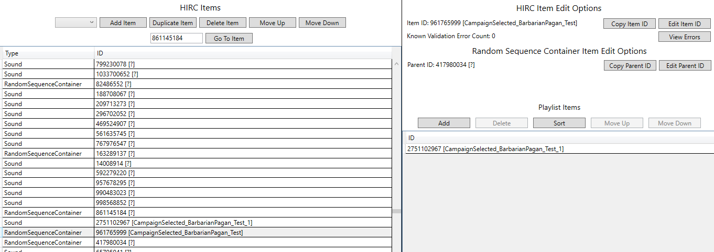

## Overview
This guide will walk you though the steps of how to convert a custom audio file to a format that can be used ingame and how to replace the game's default campaign voicelines with your custom audio. Specifically, we will be making the game play a custom voiceline whenever you select a general on the campaign map.

Click the image below to hear an example of this guide's final result:  

## Prerequisites
1. SoundbankEditor - This application allows you to modify Total War Attila soundbank (`.bnk`) files. Note that the current version of SoundbankEditor is pre-alpha and your feedback will help improve it. You can download SoundbankEditor at https://github.com/TheTollski/SoundbankEditor/releases
2. AssetEditor - We will use a tool in this application called Audio Explorer which helps visualize audio events. You can download AssetEditor at https://github.com/donkeyProgramming/TheAssetEditor/releases
3. Wwise - We will use this application to convert audio files to a format that can be used by Total War Attila. In this guide I used Wwise version 2023.1.0. You can install Wwise through the Audiokinetic Launcher which you can download at https://www.audiokinetic.com/en/download/
  * Alternatively, you can download CA's official music modding kit for creating audio files for Rome 2 and Attila. This is the recommended tool for creating audio files for The Dawnless Days: https://cdn.creative-assembly.com/total-war/total-war/music-toolkit/Rome_2_Music_Modding_Kit.zip
4. Rusted PackFile Manager (RPFM) or a similar packfile editing application - We will use this application to create and modify your mod's packfile. You can download RPFM at https://github.com/Frodo45127/rpfm/releases

## Step 1: Convert your audio file.
Total War Attila can only read audio files that have the  `.wem` extension. In this step we will convert a `.wav` audio file to `.wem`. If you wish to skip this step, you can use the attached `234567890.wem` audio file.

1. Open Wwise.
2. Create a project.
3. Click the `ShareSets` tab, expand `Conversion Settings` > `Factory Conversion Settings` > `Vorbis`, copy `Vorbis Quality High` and paste to create a new Conversion Setting (call it `Vorbis Quality High - Campaign VO`), and edit the new Conversion Setting's options to enable `Insert filename marker`.  

4. Select `Project` and click `Project Settings...`. In the new window click Source Settings and set `Default Conversion Settings` to `Vorbis Quality High - Campaign VO` and click `OK`.  

5.  Select `Project` and click `Import Audio Files...`. In the new window click `Add Files...`, select your `.wav` audio file, and click `Import`.
6. Select `Project` and click `Convert All Audio Files...`. In the new window ensure `Windows` is selected and click `Convert`. There should now be a converted `.wem` audio file in your Wwise project's `.cache\Windows` folder (e.g. `C:\Users\MyUserName\Documents\WwiseProjects\MyWwiseProjectName\.cache\Windows\SFX`).

[234567890.wem](Campaign_VO_Resources/234567890.wem)

## Step 2: Set up your mod's packfile and add the converted audio file to it.
In this step we will set up a packfile for your mod and add the converted audio file to it.

1. Open RPFM or a similar packfile editing application.
2. Select `Game Selected` and click `Attila`.
3. Create a packfile for your mod or open the packfile of a mod you want to edit.
4. Create a folder called `audio`.
5. Add your converted `.wem` audio file to the mod's `audio` folder.
6. Rename the the audio file so the file name is a random Wwise short ID (i.e. a number between 0 and 4,294,967,295), keep the file extension as `.wem`.  

## Step 3: Edit the `campaign_vo` soundbank.
Total War Attila uses soundbanks (i.e. `.bnk` files) to determine what audio to play when events are triggered. The `campaign_vo` soundbank is set up so that the `campaign_selected` Dialogue Event takes variables for culture, subculture, and character type and has a decision tree which references RandomSequenceContainers which reference lists of Sounds. In other words, when the game triggers the "campaign selected" campaign VO dialogue event it will use the selected character's culture, subculture, and character type in order to pick a list of random voicelines and it will play one of those random voicelines.

In this step we will edit the `campaign_vo` soundbank to so that when the game triggers the "campaign selected" campaign VO dialogue event for `barbarian_pagan` generals it will play our custom voiceline.

1. In RPFM, look in the `Dependencies` panel, expand `Game Files`, expand the `audio` folder, and extract `campaign_vo.bnk`.  

2. Open SoundbankEditor.
3. Open the extracted `campaign_vo.bnk`.
4. Go to the Dialogue Event `3949423457` (`campaign_selected`) and expand its decision tree to get the AudioNodeId for `barbarian.barbarian_pagan.Gen1Land`.  

5. Go to the RandomSequenceContainer `861145184` and duplicate it. Set the duplicated RandomSequenceContainer's Item ID to `CampaignSelected_BarbarianPagan_Test` (which gets converted to short ID `961765999`). Look at its playlist items IDs and get the first ID in the list.  

6. Go to the Sound `998568852` and duplicate it. Set the duplicated Sound's Item ID to `CampaignSelected_BarbarianPagan_Test_1` (which gets converted to short ID `2751102967`), set its Parent ID to `961765999`, set its `SourceId` and `FileId` to the short ID used for your audio file, and move it to be just above the duplicated RandomSequenceContainer in the HIRC Item list.  

7. Go to the RandomSequenceContainer `961765999` and delete all the IDs from its Playlist Items then add the ID `2751102967`.  

8. Go to the RandomSequenceContainer `417980034` and add the ID `961765999` to its Playlist Items. Note: I don't know if this RandomSequenceContainer is actually used in any events, but it inherits audio settings that are necessary for playing campaign VO audio and we need our new RandomSequenceContainer and Sound to also inherit those audio settings.  

9. Go to the Dialogue Event `3949423457` (`campaign_selected`) and expand its decision tree and set the AudioNodeId for `barbarian.barbarian_pagan.Gen1Land` to `961765999`. Note: This will only modify audio for half of the `barbarian_pagan` generals, if you want to modify the audio for all their generals you can also set the AudioNodeId for `barbarian.barbarian_pagan.Gen2Land`.  

10. Save the soundbank.

## Step 4: Add the edited soundbank to the mod's packfile, configure an additional faction to use your custom audio, and install the mod into Total War Attila.
In this step we will add the edited soundbank to your mod, we will configure the Western Roman Empire to use your modified `barbarian_pagan` campaign voiceover culture, and then we will install your mod to be used by Total War Attila.

1. Open RPFM.
2. Add your edited `campaign_vo.bnk` and SoundbankEditor's autogenerated `campaign_vo_custom_names.txt` into the mod's `audio` folder. Note: The custom names file is not required for the audio to play ingame but it is used by SoundbankEditor to show any custom text IDs that you have added into the soundbank.  

3. Create a DB based on the `factions_tables` schema and call it `factions_test`. Then, look in the `Dependencies` panel, expand `Game Files`, expand the `db` folder, expand `factions_tables`, open `factions`, select line 138 (the row with `att_fact_western_roman_empire`), copy it, open `factions_test` (which you just created), right click in the empty window and select `Paste as New Row`, and set the new row's Voiceover Subculture to `att_sub_cult_eastern_sassanid`. Note: We are just using a random subculture for demonstration purposes.  

3. Create a DB based on the `subculture_religion_voiceover_junctions_tables` schema and call it `subculture_religion_voiceover_junctions_test`. Open `subculture_religion_voiceover_junctions_test` (which you just created), right click in the empty window and select `Add Row`, and set the new row's Religion to `att_rel_chr_catholic`, set its Subculture to `att_sub_cult_eastern_sassanid`, and set its Voiceover Culture to `barbarian_pagan`.  

3. Select `PackFile` and click `Save PackFile`.
4. Select `PackFile` and click `Install`.

## Viewing your changes in AssetEditor.
If you want to view the audio configuration when all soundbanks are loaded you can use AssetEditor's Audio Explorer. This can be helpful for debugging issues when sound is not playing ingame as expected. In this section, we will take a look at the `campaign_selected` dialogue event's configuration to verify our changes.

1. Open AssetEditor.
2. Select `Options` and click `Settings`. Set `Current Game` to `Attila` and click `Save`.
3. Select `File`, select `Load all game packfiles`, and click `Attila`.
4. Select `File`, click `Open`, and load the mod's packfile.
5. Select `Tools`, select `Audio`, and click `Audio Explorer`.
6. In the Audio Explorer, select the event `campaign_selected`. Verify that it uses your custom audio file for `barbarian.barbarian_pagan.Gen1Land`.  

## Testing your changes ingame.
Now it is time to hear our custom audio ingame.

1. In the Total War Launcher, ensure your mod is enabled and at the top of the load order.  

2. Launch Total War Attila, start a new Grand Campaign with the Western Roman Empire, and ensure that your custom audio plays when you select the general in Augusta Vindelicorum. Note: Some of your generals will still use their default selection voicelines unless you also set the AudioNodeId for `barbarian.barbarian_pagan.Gen2Land` in the soundbank. Also, since we overrode the `barbarian_pagan` Voiceover Culture you will hear your custom audio when playing the Franks and Saxons. While we also overrode the `att_sub_cult_eastern_sassanid` subculture, we only overrode it for the `att_rel_chr_catholic` religion so you won't hear your custom audio when playing the Sassanids because they don't have the Latin Christianity religion.

## Example Packfile

I have attached the mod packfile which I created for this guide. If you are having any issues with getting your custom audio to play ingame you can download the packfile and compare it against yours.

[test_campaign_vo.pack](Campaign_VO_Resources/test_campaign_vo.pack)

## Next Steps

In SoundbankEditor you can add/edit more Sound items and add their IDs to the RandomSequenceContainer to have a pool of sounds that can play at random when a general is selected. You can also configure custom sound to play for other subcultures and configure custom sound to play for different campaign VO events, like when you attack an enemy army.

If you want to learn more about how Wwise audio works, you can take a look at the documentation for WWISER, an application that parses `.bnk` files: https://github.com/bnnm/wwiser/blob/master/doc/WWISER.md