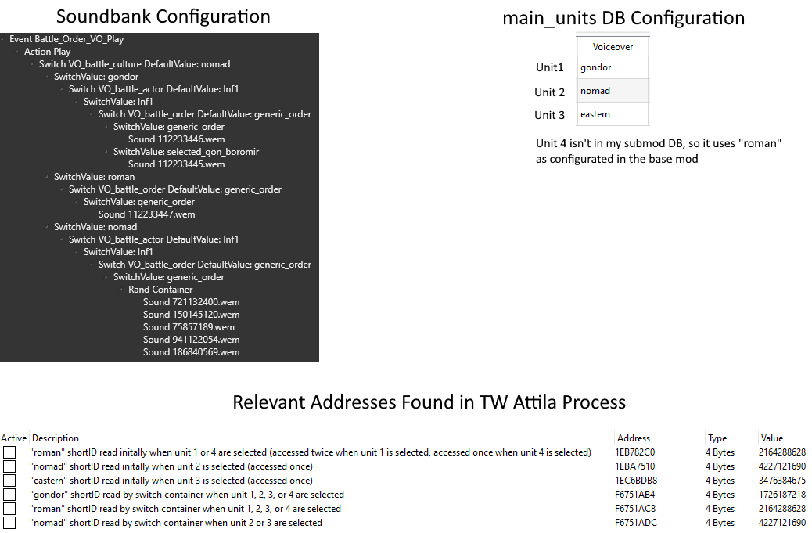
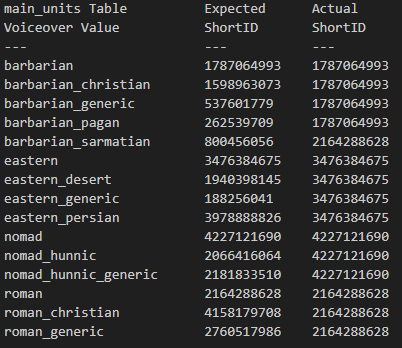
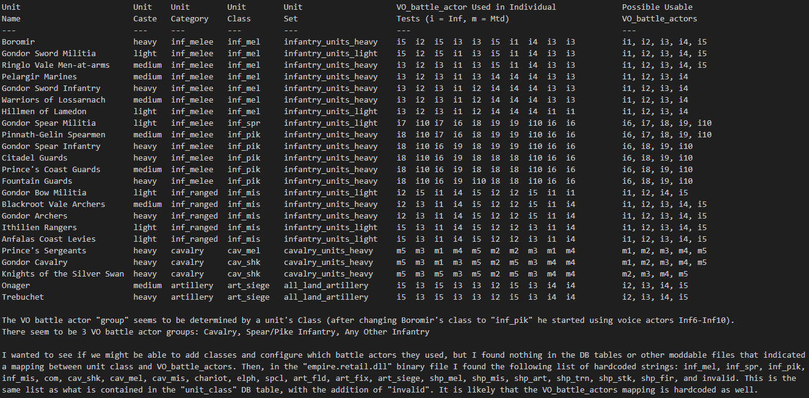
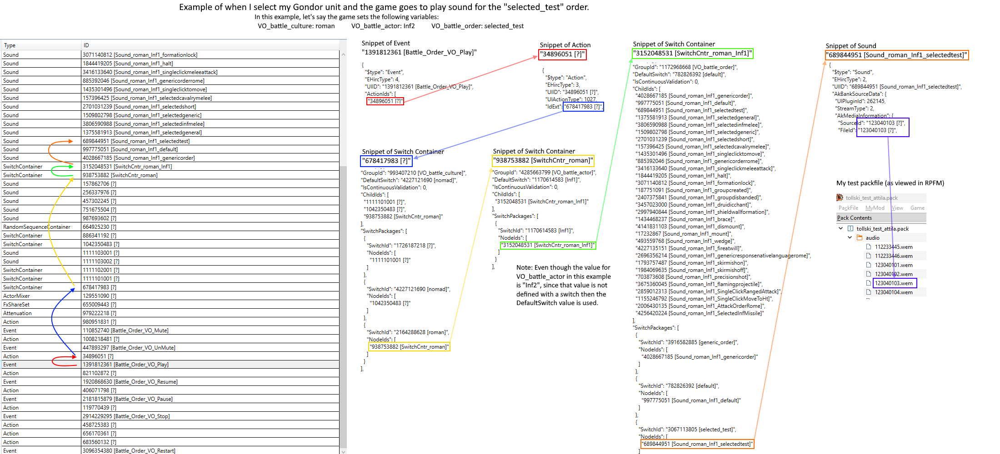

## 1
I've done a little digging using Cheat Engine into what's actually happening ingame. There are three addresses in Attila's process which have the value 1726187218 (the hashed shortID for "gondor") which indicates that the `.bnk` and `.dat` files are configured correctly:
1. One of the addresses is consistently accessed by a `cmp` instruction whenever a unit is selected ingame. This `cmp` instruction is the branch in the switch container in the soundbank which checks if the unit's culture is "gondor".
2. The other two addresses are never accessed, but they correspond to the "VO_battle_culture" and "vo_battle_subculture" sections in the `.dat` file which I added "gondor" to. I confirmed this by testing with the vanilla `.dat` and seeing two fewer addresses storing 1726187218.

1. I tried to find a few pieces of what happens in the code when a unit is selected.
* For a unit that is configured to use a base-game culture (e.g. "nomad" with shortID 4227121690) and that culture is supported in the soundbank: When that unit is selected ingame there is an address storing 4227121690 which is accessed initially by a `mov` instruction and then a different address storing 4227121690 which is accessed by a `cmp` instruction (comparing against 4227121690).
* For a unit that is configured to use a base-game culture (e.g. "eastern" with shortID 3476384675) and that culture **is not** supported in the soundbank: When that unit is selected ingame there is an address storing 3476384675 which is accessed by a `mov` instruction. There is no associated address that is read by a `cmp` instruction, I did verify that the other `cmp` instructions compare against 3476384675.
* For a unit that is configured to use a **custom** culture (e.g. "gondor" with shortID 1726187218) and that culture is supported in the soundbank: When that unit is selected ingame there is an address storing **2164288628** (the shortID for "roman") which is accessed initially by **two** `mov` instructions and then a different address storing 4227121690 which is accessed by a `cmp` instruction (comparing against **2164288628**).

So, for "gondor" there is a missing configuration that the game tries to initially read when the unit is selected and since it is not found it defaults to using the "roman" shortID.

Here is an image with more context that probably isn't necessary but I wanted to save it somewhere:



## 2
**TL;DR I have some bad news regarding custom cultures in battle voiceovers. It looks like battle voiceover cultures are hardcoded into the game, which if true means that we are constrained to reusing the base game's 4 battle voiceover cultures unless we created a custom patch for the game files. There may be ways we can use the voice actors to give us a little more customization (as Maestro mentioned a while ago), though, which is worth investigation**

In my investigation of the game files I came across an alarming list of text in `empire.retail.dll`: barbarian, barbarian_christian, barbarian_pagan, barbarian_generic, nomad, nomad_hunnic, nomad_hunnic_generic, eastern, eastern_desert, eastern_persian, eastern_generic, roman_christian, roman_generic, invalid_voiceover_culture

This list is very similar to the names contained in the assembly kit's `audio_voiceover_cultures` table except that the list in the `.dll` has `invalid_voiceover_culture` and doesn't have `barbarian_sarmatian`. So, to help verify that the list in the `.dll` is actually used in battle voiceovers I tested by trying all values from the `audio_voiceover_cultures` units' Voiceover columns in the `main_units` table and here are the results:


Important takeaways from this table are that:
1. The game automatically converts subcultures to the main culture. If you put `barbarian_christian` in a unit's Voiceover column and `barbarian_generic` in another unit's Voicever column the game will use `barbarian` as the culture that it passes to the soundbank for both units.
2. The game doesn't treat `barbarian_sarmatian` as a valid value (it defaulted to using the shortID for "roman" just like what happens to any of the other custom voiceover values I've tried). This was more evidence that the `audio_voiceover_cultures` is meaningless and was an indication that the list from the `.dll` was what the game was actually using.

To ensure that the list from the `.dll` was being used, I replaced `nomad` with `abcde` using a hex editor and the unit that has its Voiceover value set to nomad and which was previously playing the nomad voice lines just fine was now playing roman voicelines, indicating that the game no longer recognized `nomad` as a valid voiceover culture and was using the default `roman`.


## 3
**TL;DR I have some more bad news. The logic for determining which VO_battle_actor to use for a given unit seems to be hardcoded as well.**

There are 3 known VO battle actor groups which correspond to the following types of units: Cavalry, Spear/Pike Infantry, Any Other Infantry (note: there are 2 infantry and 2 mounted VO battle actors that I wasn't able to get to play, perhaps signaling the existence of more groups). It is the unit's `class` which is specifically used for selecting the VO battle actor. I had a small hope that we might be able to add new subculture-related classes as a way to make our own type of VO battle subcultures, but the list of defined classes is actually hardcoded into the game.

Here are the details on how I came to this conclusion:


Without patching the game files, it appears that we are constrained to 4 cultures. This means there will be multiple factions sharing the same cultures and thus using the same generic voice lines in most situations. We can configure custom unit selection orders, allowing us to play custom sounds when those units are selected, but a unit's selection order is only used about 40% when that unit is selected; the other 60% of the time that the unit is selected it uses a more generic order which is shared with other units.


## 4
There is no true concept of subcultures in the battle voiceovers. Our decision trees for selecting which audio file to play when a battle voiceover event is triggered are only given the following 3 variables (that we know of): `VO_battle_culture`, `VO_battle_actor`, and `VO_battle_order`.

1. `VO_battle_culture` can only be `barbarian`, `eastern`, `nomad`, or `roman`.
2. `VO_battle_actor` can be `Inf1 - Inf10` and or `Mtd1 - Mtd5`, but really these are broken into 3 groups: Cavalry (`Mtd1` - `Mtd5`), Polearm Infantry (`Inf6` - `Inf10`), and Any Other Infanty (`Inf1` - `Inf5`).
3. `VO_battle_order` can be a number of hardcoded values (e.g. `group_created`, `rally`, `single_click_melee_attack`, etc) and customized selection orders (e.g. `selected_gon_boromir`). There are small few of the hardcoded battle orders which look like they are subculture specific  (e.g. `attack_order_barbarian_christian`, `attack_order_barbarian_pagan`) but they don't cover all subcultures so I don't know if they're actually used. 


## 5
1. The `VO_battle_culture`, `VO_battle_actor`, and `VO_battle_order` variables are used by the `Switch Container` Wwise object. If you have any programming experience, a `Switch container` is essentially just a `switch statement`. It is a way for the game to choose what to do based on the value of a variable, like a decision tree with specific outcomes for different possibilities. When the game goes to play a battle order the first switch container that runs is the one that takes VO_battle_culture and its list of switch values are "barbarian", "eastern", "nomad", and "roman". Each of those values is linked to another Wwise object (either a Sound, RandomSequence, or another Switch Container). Since we can edit the soundbank however we want, we have full control on what audio file plays as an end result.
2. If the general is selected and the game arbitrarily decides to use the `selected_general` order then if the switch container for VO_battle_order is set up with a switch value for `selected_general` but it is linked to a Sound object for an audio file that doesn't exist then no sound will play. In the same situation, if the switch container is not set up with a switch value for `selected_general` then it will try to that switch containers default switch value (e.g. `generic_order`) and if no default switch value exists then no sound will play.
3. We can create custom selection VOs by simply adding them as switch values to the switch container for VO_battle_order. 

Take a look at this image with a breakdown of everything that happens with my current test soundbank when I select a unit that is configured with selection VO `selected_test` and the game decides to use that as the vo order to play:



## 6
Thinking of it like a function in code that the game might call that would look something like `playBattleOrder(string culture, string actor, string order)`. We get to define all the logic that is inside this function. We can control which `culture` is passed in for any given unit, but we are limited to the 4 base game cultures. We can't really control which `actor` is passed in, but we know that it is controlled by the unit's class. We cannot strictly control which `order` is passed in, but we can set custom selection orders that the game will use about 40% of the time that a unit is actually selected.


## 7
CA dev after being asked about hardcoded voiceover cultures: `Can confirm, voiceover culture types have an underlying ENUM`


## 8
Here is a list of all battle orders I identified while playing Gondor (and like 1 battle playing another faction). This is not a definitive list of every battle order in the game, though, as the vanilla soundbank has a whole lot more battle orders in it:
```
attack_order_rome
attack_order_rome_christian
brace
break_off
dismount
double_click_attack
double_click_attack_ht
double_click_fast_move_to
double_click_fast_move_to_ht
druidic_chant
fire_at_will
flaming_projectile
flying_wedge
formation
formation_lock
formation_unlock
generic_order
generic_order_rome
generic_order_rome_christian
generic_response_native_language_rome
group_created
group_disbanded
halt
land_rapid_advance
melee_off
melee_on
mount
pike_phalanx
precision_shot
quick_reload
rally
selected_artillery_siege
selected_axemen
selected_cavalry_melee
selected_cavalry_missile
selected_cavalry_shock
selected_general
selected_generic
selected_generic_christian_rome
selected_horse_archers
selected_inf_melee
selected_inf_missile
selected_inf_pikemen
selected_inf_spearmen
selected_short
selected_test*              *This is the only custom selection order I defined in the DB.
shieldwall_formation
single_click_melee_attack
single_click_melee_attack_ht
single_click_move_to
single_click_move_to_ht
single_click_ranged_attack
single_click_ranged_attack_ht
skirmish_off
skirmish_on
wedge
withdraw
```

I did a few tests, selecting Boromir and Ithilien Rangers 50 times each, here are the battle orders which were used (both units were configured with `selected_test` as their custom selection VOs):
```
Boromir
selected_test                       21  42%
selected_general                    22  44%
selected_generic_christian_rome     3   6%
selected_inf_melee                  3   6%
selected_generic                    1   2%

Ithilien Rangers
selected_test                       23  46%                  
selected_inf_missile                17  34%
selected_generic                    4   8%
selected_short                      3   6%
selected_generic_christian_rome     3   6%
```